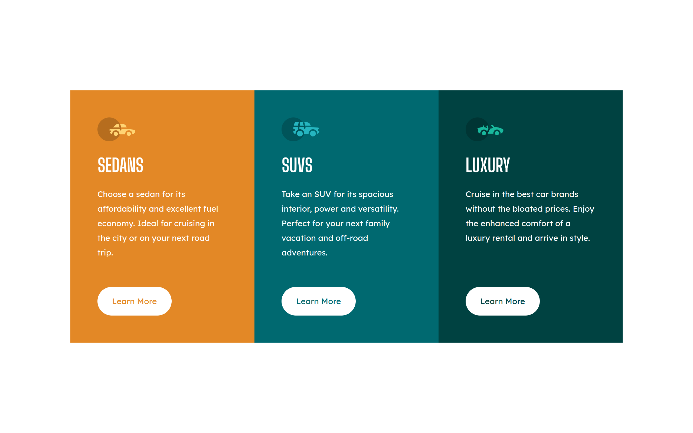

# Frontend Mentor - 3-column preview card component solution

This is a solution to the [3-column preview card component challenge on Frontend Mentor](https://www.frontendmentor.io/challenges/3column-preview-card-component-pH92eAR2-). Frontend Mentor challenges help you improve your coding skills by building realistic projects.

### Screenshot



### Links

- [Live Site URL:](https://bytepack-frontendmentor-3column-card.pages.dev/)

## My process

### Built with

- HTML5
- CSS3

### What I learned

Using level 4 media queries to detect devices that can handle hover state  
- [Read this article:](https://medium.com/@mezoistvan/finally-a-css-only-solution-to-hover-on-touchscreens-c498af39c31c)

```css
 /* devices that can handle hover */
@media(hover: hover) and (pointer: fine) {
  .cards__link:hover{
    color: #fff;
    background-color: rgba(0,0,0,0);
  }
}
```
